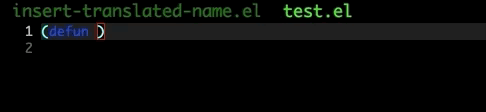
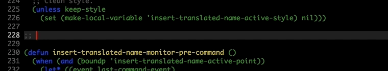
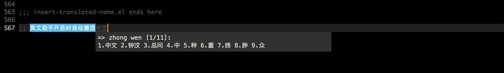

对于我这种英语渣来说, 有时候给一个函数或者变量取一个适当的名字还是比较麻烦的, 一般都要打开 Google 翻译, 翻译一段中文, 然后拷贝到 Emacs 中做各种修改, 改成下划线或者骆驼风格的形式, 甚至直接翻译成英文注释.

给Emacs写了一个小插件 [insert-translated-name](https://github.com/manateelazycat/insert-translated-name)



1. 执行 ```insert-translated-name-insert``` 命令进入输入激活模式
2. 正常输入中文
3. 中文后输入空格自动查询翻译并替换成符合当前语言风格的变量名(或函数名)




如果当前光标在注释或者字符串区域, 会自动插入英文注释:
1. 执行 ```insert-translated-name-insert``` 命令进入输入激活模式
2. 正常输入中文
3. 中文后输入空格自动查询翻译并替换成英文注释



如果你安装了 [pyim](https://github.com/tumashu/pyim) 输入法，写英文注释的时候会自动激活切换输入法：
1. 执行 ```insert-translated-name-insert``` 命令进入输入激活模式，并自动激活中文（不用手动切换中文输入法）
2. 正常输入中文
3. 中文后输入空格自动查询翻译并替换成英文注释（并自动切换成英文输入状态）

### 安装

1.  下载 [insert-translated-name](https://github.com/manateelazycat/insert-translated-name) 里面的 insert-translated-name.el 放到 ~/elisp 目录
2.  把下面的配置加入到 ~/.emacs 中
```
(add-to-list 'load-path (expand-file-name "~/elisp"))
(require 'insert-translated-name)
```

### 使用
| 命令                                               | 描述                                       |
| :--------                                          | :----                                      |
| insert-translated-name-insert                      | 按照当前语言风格自动插入翻译后的名字       |
| insert-translated-name-insert-with-underline       | 按照下划线风格自动插入翻译后的名字         |
| insert-translated-name-insert-with-camel           | 按照骆驼风格自动插入翻译后的名字           |
| insert-translated-name-insert-with-line            | 按照连接线风格自动插入翻译后的名字         |
| insert-translated-name-insert-original-translation | 按照当前语言风格自动插入翻译               |
| insert-translated-name-replace                     | 按照当前语言风格自动替换中文为翻译后的名字 |
| insert-translated-name-replace-with-underline      | 按照下划线风格自动替换中文为翻译后的名字   |
| insert-translated-name-replace-with-camel          | 按照骆驼风格自动替换中文为翻译后的名字     |
| insert-translated-name-replace-with-line           | 按照连接线风格自动替换中文为翻译后的名字   |

```insert-translated-name-insert``` 命令会根据当前的环境来自动切换不同的翻译风格， 如果匹配下面的规则， 则直接使用返回的翻译结果：
1. 当前模式如果设置了变量 ```insert-translated-name-original-translation``` （由函数 insert-translated-name-use-original-translation 设置）
2. 在字符串或者注释中
3. 在magit commit buffer 中
4. 在minibuffer中

当然，你也可以在调用命令 ```insert-translated-name-insert``` 之前按一下 C-u 也是可以的。

下面是各种语言预定的风格, 如果你不喜欢默认风格, 可以定制以下变量的内容:
```
(defvar insert-translated-name-origin-style-mode-list
  '(text-mode))

(defvar insert-translated-name-line-style-mode-list
  '(web-mode emacs-lisp-mode))

(defvar insert-translated-name-camel-style-mode-list
  '(js-mode))

(defvar insert-translated-name-underline-style-mode-list
  '(ruby-mode))
```

### 自定义

#### 翻译引擎
默认使用 google.cn 翻译(不需要梯子), 如果你更喜欢有道, 修改 ```insert-translated-name-translate-engine``` 的值为 "youdao" 即可.
Google 的长句翻译更加准确一点.

自己拯救自己的英语, 哒哒.

#### 添加英文模式
如果你想在其它模式激活 ```insert-translated-name-insert``` 的时候自动使用英文翻译， 而不是变量名， 可以用下面的方式来支持：
```
(dolist (hook (list
               'atomic-chrome-edit-mode-hook
               ))
  (add-hook hook '(lambda () (insert-translated-name-use-original-translation))))
```
